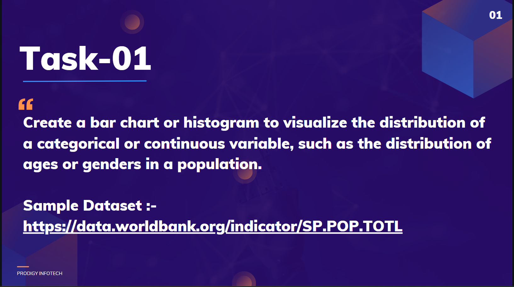

Task-1: Data Visualization
==========================

Objective
---------

To create a bar chart or histogram visualizing the distribution of a categorical or continuous variable. For this task, we'll use the World Bank's population data to visualize the population distribution across different countries.

Data Source
-----------

Kaggle

Tools Used
----------

Power BI

Steps Involved
--------------

1.  **Data Import:** Import the population data from the World Bank's website into Power BI.
2.  **Data Cleaning and Preparation:** Clean and prepare the data for visualization, ensuring consistency and accuracy.
3.  **Visualization Creation:** Create a bar chart or histogram to display the population distribution. Customize the chart with appropriate titles, labels, and formatting.

